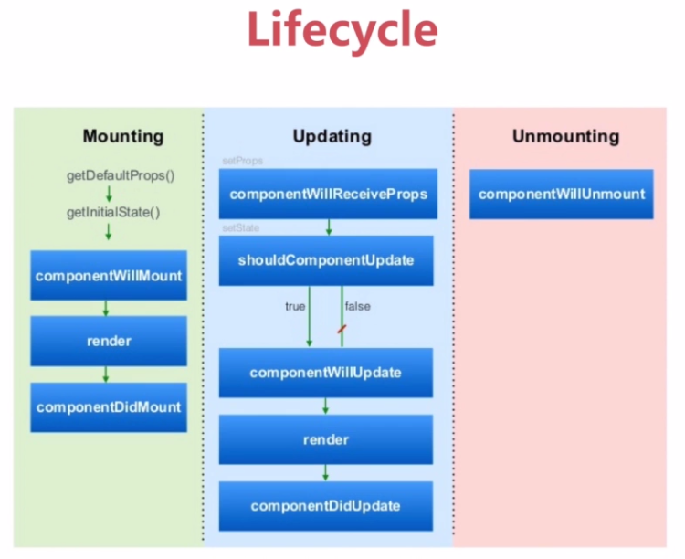

# React

1. ReactDOM.render(): 用于将模板转为HTML语言，并插入指定DOM节点。ReactDOM.render()应该只在复合组件被定义之后被调用。
```
ReactDOM.render(
  <h1>Hello, world!</h1>,
  document.getElementById('example')
);
```
2. JSX语法：
    1. 遇到HTML标签(以“<”开头)用HTML规则解析，遇到代码块(以“{”开头)用JavaScript规则解析。
    2. 允许直接在模板中插入js变量，如果变量是数组，会把它所有的成员添加到模板中。
3. 组件：使用React.createClass()方法生成一个组件类。
    1. 每一个组件类必须有render方法，用于输出组件。
    2. 给组件类命名时第一个字母必须大写，否则没有效果(*原文说会报错，我试了下，并没有报错，只是没有效果*)。
    3. 组件类只能包含一个顶层标签，否则会报错，这一点同vue2.0。
    4. 使用组件类时，在模板中插入`<ComponentName propName="propValue"/>`(必须有'/'，否则报错)或者`<ComponentName propName="propValue"></ComponentName>`，会自动生成相应组件类的一个实例。
    5. 使用组件时可以添加任意属性，组件的属性在组件类中通过this.props对象获取。使用class属性时需写成className，使用for属性时需写成htmlFor，这是因为class和for是JavaScript的保留字
    ```
    var HelloMessage = React.createClass({
        render: function(){
            return <h1>Hello {this.props.name}</h1>
        }
    });
    ReactDOM.render(
        <HelloMessage name="John"/>,
        document.getElementById('example')
    );
    ```
    6. this.props.children:this.props对象的属性与组件的属性一一对应，但是this.props.children除外，它表示组件的所有子节点。当组件没有子节点时，它是undefined，当有一个子节点时，它是一个object，当有多个子节点时，它是一个数组。React提供了React.Children来处理this.props.children。使用React.Children.map来遍历子节点，无需担心是什么数据类型。
    7. PropTypes属性: 验证别人使用组件时，提供的参数是否符合要求。如下例子，设置title属性必须是字符串且是必须的。
    ```
    var MyTitle = React.createClass({
        propTypes: {
            title: React.PropTypes.string.isRequired
        },
        render: function(){
            return <h1>{this.props.title}</h1>
        }
    })
    var data = 123;
    ReactDOM.render(
        <MyTitle title={data}/>,
        document.getElementById('example')
    );
    ```
    8. getDefaultProps: 设置组件属性的默认值
    ```
    var MyTitle = React.createClass({
        getDefaultProps : function () {
            return {
                title : 'Hello World'
            };
        },
        render: function() {
            return <h1> {this.props.title} </h1>;
        }
    });
    ```
    9. 获取真实DOM节点：组件并不是真实的DOM节点，而是存在于内存中的一种数据结构，叫做虚拟DOM，只有当它插入到文档之后，才会变成真实的DOM。所有的DOM变动，都先在虚拟DOM上发生，然后再将实际发生变动的部分，反应在真实的DOM上，这样可以极大提高网页的性能。同时，我们不生成HTML字符串，因此XSS防护是默认特性。当需要从组建中获取真实的DOM节点时，需要使用ref属性，在组件类中通过this.refs.refName就可以获得真实的DOM节点。由于this.refs.refName获取的是真实的DOM，所以必须等到虚拟DOM插入文档之后，才能使用这个属性，否则会报错。*input便签必须有'/'闭合, onClick属性中c必须大写*
    ```
    var MyComponent = React.createClass({
        handleClick: function(){
            this.refs.myTextInput.focus();
        },
        render: function(){
            return (
                <div>
                    <input type="text" ref="myTextInput"/>
                    <input type="button" value="Focus the text input" onclick={this.handleClick}/>
                </div>
            );
        }
    })
    ```
    10. this.state: getInitialState方法用于定义初始状态，返回一个对象，这个状态对象通过this.state属性读取，通过this.setState方法修改，每次修改后，自动调用this.render方法再次渲染组件。
    ```
    var LikeButton = React.createClass({
        getInitialState: function(){
            return {
                liked: false
            };
        },
        handleClick: function(){
            this.setState({liked: !this.state.liked});
        },
        render: function(){
            var text = this.state.liked ? 'like' : 'haven\'t liked';
            return (
                <p onClick={this.handleClick}>
                    You {text} this. Click to toggle.
                </p>
            );
        }
    })
    ```
    11. 获取表单数据(给表单绑定事件)
    ```
    var Input = React.createClass({
        getInitialState: function(){
            return {
                value: "hello"
            };
        },
        handleClick: function(event){
            this.setState({value: event.target.value});
        },
        render: function(){
            var value = this.state.value;
            return (
                <div>
                    <input type="text" value={value} onChange={this.handleClick}/>
                    <p>{value}</p>
                </div>
            );
        }
    })
    ```
    12. 生命周期：组件的生命周期分为三个状态：Mounting 已插入真实DOM， Updating 正在被重新渲染， Unmounting 已移除正式DOM。每个状态有两种处理函数，will函数在进入状态之前调用，did函数在进入状态之后调用。三种状态共计5种处理函数, React还提供了两种特殊状态的处理函数：
        1. componentWillMount()
        2. componentDidMount() //需要DOM node的初始化应该放在这里
        3. componentWillUpdate(object nextProps, object nextState) // 在此不能调用this.setState()
        4. componentDidUpdate(object nextProps, object nextState)
        5. componentWillUnmount()
        6. componentWillReceiveProps(object nextProps) // 当挂在的组件接收到新的props时被调用。应该被用于比较this.props和nextProps以用于使用this.setState()执行状态转换。
        7. shouldComponentUpdate(object nextProps, object nextState) // 组件决定任何改变是否要更新到DOM时被调用，如果应该跳过更新，返回false。
        
    13. 当需要从子组件向父组件传递数据时，可以在父组件的render函数中使用子组件时绑定一个自定义事件，然后在子组件中触发事件时将数据作为参数传过来
    ```
    //父组件
    var CommentBox = React.createClass({
        handleCommentSubmit: function(comment){
            //comment即为从子组件中传过来的数据
        },
        render: function(){
            return (
                <div className="commentBox">
                    <h1>Comments</h1>
                    <CommentList data={this.state.data}/>
                    **<CommentForm onCommentSubmit={this.handleCommentSubmit}/>**
                </div>
            );
        }
    });
    //子组件
    var CommentForm = React.createClass({
        handleSubmit: function(event){
            event.preventDefault();
            var author = this.state.author.trim();
            var text = this.state.text.trim();
            if(!author || !text){
                return;
            }
            **this.props.onCommentSubmit({author: author, text: text});** //触发父组件自定义事件，将数据作为参数传给父组件
            this.setState({author: '', text: ''});
        },
        render: function(){
            return (
                <form className="commentForm" onSubmit={this.handleSubmit}>
                    //
                </form>
            );
        }
    });
    ```
    14. props VS state: state主要用来实现UI交互，props是从父组件向子组件传递数据。当我们决定一个数据是不是应该使用state时，可以根据以下三条原则来决定：
        * 它是通过props从一个父组件传递过来的吗？如果是，不应该设置成state
        * 它是一只不改变的吗？如果是，不应该设置成state
        * 它可以通过其他的props或者state计算出来吗？如果是，不应该设置成state
4. 第三方库remarkable，一个纯JavaScript的markdown解析器。使用前需先引入库文件
```
var Comment = React.createClass({
    render: function(){
        **var md = new Remarkable();**
        return (
            <div className="comment">
                <h2 className="commentAuthor">
                    {this.props.author}
                </h2>
                **{md.render(this.props.children.toString())}**
            </div>
        );
    }
});

<Comment author="Pete Hunt">this is one comment</Comment>
<Comment author="Jordan Walke">this is *another* comment</Comment>
```
使用Comment组件时，可在内部直接写markdown格式，但是这样渲染出来的文本会直接显示<p>等html标签，这是因为React为防止XSS攻击做了相应处理，为了需要进行如下修改：
```
var Comment = React.createClass({
    **rawMarkup: function(){
        var md = new Remarkable();
        var rawMarkup = md.render(this.props.children.toString());
        return {__html: rawMarkup};
    },**
    render: function(){
        return (
            <div className="comment">
                <h2 className="commentAuthor">
                    {this.props.author}
                </h2>
                **<span dangerouslySetInnerHTML={this.rawMarkup()} />**
            </div>
        );
    }
});
```
5. 使用ES6 class语法定义组件时，在组件内使用static defaultProps定义默认props，会报错。原因是static定义的静态属性不属于ES6，而是在ES7的草案中，需要安装babel-preset-stage-0，并且在presets设置中添加"stage-0"。
```
// 在webpack.config.js中配置
{
    test: /\.js$/,
    exclude: /node_modules/,
    loader: 'babel-loader',
    query: {
        presets: ['es2015', 'react', 'stage-0']
    }
}
// 在.babelrc文件中配置
{
    "presets": ["es2015", "react", "stage-0"]
}
```
